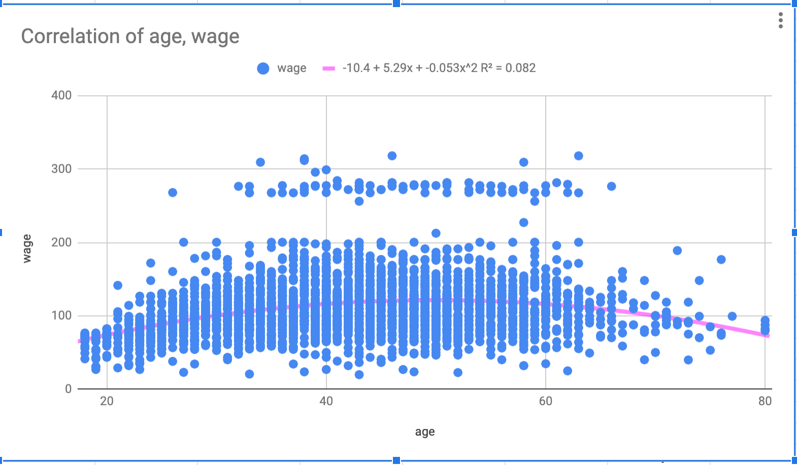

# ML-sandbox
Statistical approach to Machine learning models

- /dataset: .csv and .gsheet files (for data discovery)

## Data Discovery

#### Notes

1. the statistical book [download](http://faculty.marshall.usc.edu/gareth-james/ISL/ISLR%20Seventh%20Printing.pdf)
2. the more detailed book [download](https://web.stanford.edu/~hastie/ElemStatLearn/download.html)